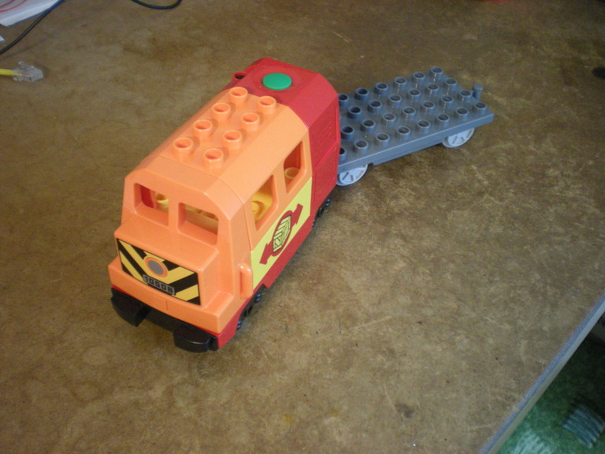

# LEGO DUPLO remote controlled locomotive build log

This log captures the process of modifying a Lego DUPLO machine to be remote controlled.

## Features

* go forward/backward, stop
* front and rear lights
* automatic shutdown (as the original engine)
* radio remote control
* adjustable (trim potentiometer) transmit power
* power & TX indication LEDs
* RX indication LED
* preserve the audio - power the original PCB on the engine; top button wired to MCU to allow using the engine without remote
 * short press - go forward
 * long press - go backward

# Build log

Timelapse of the build

## 2016-07-01

Ordered LEGO bricks from The_Duplo_Store via bricklink.com.

* [Used] Dark Bluish GrayDuplo, Train Base 4 x 8 with Light Bluish Gray Train Wheels and Moveable Hook
* [Used] OrangeDuplo, Train Locomotive Cabin Roof 2 x 4 Studs, 4 Medium Windows
* [Used] OrangeDuplo, Train Locomotive Front with Silver Headlight, 10508 and V Stripes Pattern
* [Used] RedDuplo, Train Passenger Locomotive Base with Black Battery Compartment, Light Bluish Gray Wheels
* [Used] YellowDuplo, Train Cab / Tender Base with Bottom Tubes with Box and Arrows Pattern on Both Sides

## 2016-07-08

Received the LEGO bricks.

After _thorough_ cleanup, but hey, batteries included..

### Radio control
I've bought 433Mhz transmitter + receiver modules (http://www.ebay.com/itm/380717845396)
This is the first time I'm dealing with RF, so some troubles are expected, but I'm not rolling my own transmitter or receiver so they should be small.

[useful documentation](http://forum.hobbycomponents.com/viewtopic.php?f=25&t=1324)

#### Transmitter

* Product Model: MX-FS-03V 
* Launch distance :20-200 meters (different voltage, different results) 
* Operating voltage :3.5-12V 
* Dimensions: 19 * 19mm
* Operating mode: AM 
* Transfer rate: 4KB/s 
* Transmitting power: 10mW 
* Transmitting frequency: 433M

#### Receiver

* Product Model MX-05V 
* Operating voltage: DC5V 
* Quiescent current: 4mA
* Receiving frequency: 433MHZ
* Receiver sensitivity:-105DB
* Size: 30 * 14 * 7mm
* An extra antenna is needed, please use spiral 50Ω a quarter wavelength antenna
  * http://www.csgnetwork.com/freqwavelengthcalc.html
  * 433MHz 1/4 wavelength antenna: 0.173m long

## 2016-07-09

Set up log.

Receiver needs motor driver capable of forward and backward rotation.

## 2016-07-10

Motor driver taken from [design 1][1].
Changed mosfets in transmitter.
PCB design of transmitter and receiver.

### Reverse engineering the original circuitry
There are two ways to determine the current passing through the motor.
We can measure it, which requires desoldering the wires to the motor, or we can determine, what components are used in the original circuit and trust the designer that the parts are well sized.

I've started with the latter and found that the motor is controlled by a single PNP transistor S8550.

This is the motor driver circuit.

Since the locomotive goes only in one direction a single transistor is sufficitent. The positive battery terminal is not 100% correct, it is wired through a resistor R1, but I'm not sure about its use or value.

[1]: http://www.talkingelectronics.com/projects/H-Bridge/H-Bridge-1.html
